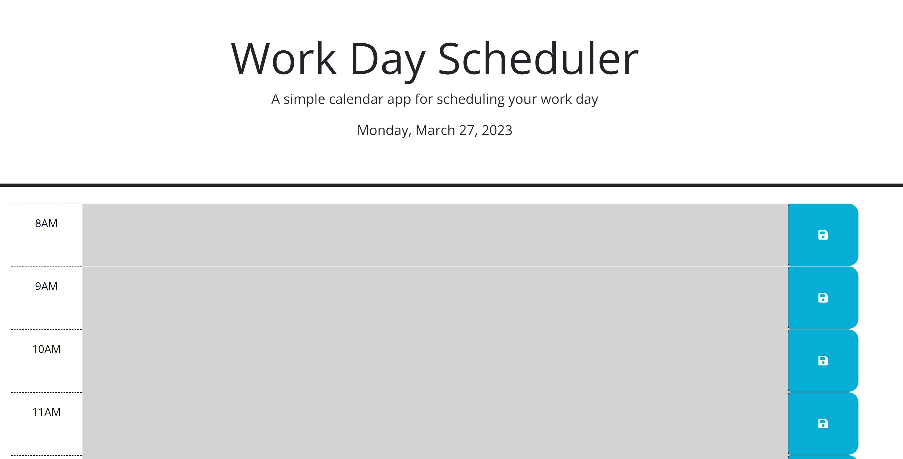

# 05-Work-Day-Scheduler
This contains the Module 5 challenge of the Rice Coding Bootcamp

## Description

An application that is a simple calendar application that allows a user to save events for each hour of the day by modifying starter code. This app will run in the browser and feature dynamically updated HTML and CSS powered by jQuery. 

## Main Site

## Location of Repository

The source code is found in the index.html file, the css code can be found within assets/css/, the js code can be found within assets/js/. All relevant images will be contained in the assets/images folder. 

## Link to Depolyed Application

The link to the deployed application can be found here: https://cnguyen1013.github.io/05-Work-Day-Scheduler